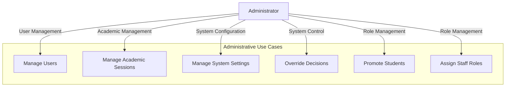

# Swebuk Platform - Use Case Diagrams and Descriptions

## Overview
Swebuk (Software Engineering Student Club) is a comprehensive online tech community and management platform designed to connect software engineering students, facilitate collaboration, and streamline academic project management.

## Use Case Diagrams

### Overall System Use Case Diagram

```mermaid
%%{init: {'theme': 'default'}}%%
graph TB
    subgraph "Swebuk Platform"
        UC1[Register Account]
        UC2[Complete Academic Profile]
        UC3[View Dashboard]
        UC4[Browse Clusters]
        UC5[Join Clusters]
        UC6[Create Personal Projects]
        UC7[Browse Projects]
        UC8[Request to Join Projects]
        UC9[Create Blog Posts]
        UC10[View Blog Posts]
        UC11[View Events]
        UC12[Register for Events]
        UC13[Access Portfolio]
        UC14[Update Profile]
        UC15[Upload Profile Picture]
        UC16[Access FYP Module]
        UC17[Approve Cluster Members]
        UC18[Approve Projects]
        UC19[Approve Blog Posts]
        UC20[Manage Clusters]
        UC21[Manage Events]
        UC22[Supervise FYP]
        UC23[Manage Users]
        UC24[Manage Academic Sessions]
        UC25[Manage System Settings]
        UC26[Override Decisions]
    end
    
    Student -- "Basic Access" --> UC3
    Student -- "Profile Management" --> UC2
    Student -- "Profile Management" --> UC14
    Student -- "Profile Management" --> UC15
    Student -- "Cluster Participation" --> UC4
    Student -- "Cluster Participation" --> UC5
    Student -- "Project Management" --> UC6
    Student -- "Project Management" --> UC7
    Student -- "Project Management" --> UC8
    Student -- "Content Creation" --> UC9
    Student -- "Content Consumption" --> UC10
    Student -- "Event Participation" --> UC11
    Student -- "Event Participation" --> UC12
    Student -- "Portfolio" --> UC13
    Student -- "FYP Access" --> UC16
    
    DeputyLeadStudent -- "Cluster Management" --> UC17
    DeputyLeadStudent -- "Content Moderation" --> UC19
    DeputyLeadStudent -- "Inherits from Student" --> Student
    
    LeadStudent -- "Cluster Management" --> UC17
    LeadStudent -- "Project Management" --> UC18
    LeadStudent -- "Content Moderation" --> UC19
    LeadStudent -- "Project Creation" --> UC6
    LeadStudent -- "Inherits from Student" --> Student
    
    Staff -- "Cluster Management" --> UC20
    Staff -- "Project Management" --> UC18
    Staff -- "Content Moderation" --> UC19
    Staff -- "Event Management" --> UC21
    Staff -- "FYP Supervision" --> UC22
    Staff -- "Inherits from Student" --> Student
    
    Supervisor -- "FYP Supervision" --> UC22
    Supervisor -- "Inherits from Staff" --> Staff
    
    Administrator -- "User Management" --> UC23
    Administrator -- "Academic Management" --> UC24
    Administrator -- "System Management" --> UC25
    Administrator -- "Decision Override" --> UC26
    Administrator -- "Inherits from Staff" --> Staff
```

### Student-Focused Use Case Diagram

```mermaid
%%{init: {'theme': 'default'}}%%
graph TB
    subgraph "Student Use Cases"
        UC1[Register Account]
        UC2[Complete Academic Profile]
        UC3[View Dashboard]
        UC4[Browse Clusters]
        UC5[Join Clusters]
        UC6[Create Personal Projects]
        UC7[Browse Projects]
        UC8[Request to Join Projects]
        UC9[Create Blog Posts]
        UC10[View Blog Posts]
        UC11[View Events]
        UC12[Register for Events]
        UC13[Access Portfolio]
        UC14[Update Profile]
        UC15[Upload Profile Picture]
        UC16[Access FYP Module]
    end
    
    Student -- "Account Management" --> UC1
    Student -- "Profile Management" --> UC2
    Student -- "Dashboard Access" --> UC3
    Student -- "Cluster Activities" --> UC4
    Student -- "Cluster Activities" --> UC5
    Student -- "Project Activities" --> UC6
    Student -- "Project Activities" --> UC7
    Student -- "Project Activities" --> UC8
    Student -- "Content Creation" --> UC9
    Student -- "Content Consumption" --> UC10
    Student -- "Event Participation" --> UC11
    Student -- "Event Participation" --> UC12
    Student -- "Portfolio Access" --> UC13
    Student -- "Profile Management" --> UC14
    Student -- "Profile Management" --> UC15
    Student -- "FYP Access" --> UC16
```

### Administrative Use Case Diagram

## Use Case Descriptions

### Use Case 1: Register Account
**Actor:** Student  
**Description:** A new user creates an account on the Swebuk platform  
**Precondition:** User is not registered  
**Main Flow:**
1. User navigates to sign-up page
2. User enters required information (email, password)
3. System validates input
4. System creates account
5. System sends verification email
6. User verifies email address
7. System completes registration

**Alternative Flow:** Input validation fails - system displays error message  
**Postcondition:** User has a verified account

### Use Case 2: Complete Academic Profile
**Actor:** Student  
**Description:** A newly registered user completes their academic profile  
**Precondition:** User has a verified account  
**Main Flow:**
1. User accesses profile completion page
2. User enters academic information (level, department, faculty, etc.)
3. User selects role (student by default)
4. System validates and saves profile information
5. User is redirected to dashboard

**Postcondition:** User has a complete academic profile

### Use Case 3: View Dashboard
**Actor:** Student, Deputy Lead Student, Lead Student, Staff, Administrator  
**Description:** User accesses their role-specific dashboard  
**Precondition:** User is authenticated  
**Main Flow:**
1. User logs in or is already authenticated
2. System determines user role
3. System redirects to appropriate dashboard
4. Dashboard displays relevant information for the user's role

**Postcondition:** User views personalized dashboard

### Use Case 4: Browse Clusters
**Actor:** Student  
**Description:** User browses available clusters (clubs)  
**Precondition:** User is authenticated  
**Main Flow:**
1. User navigates to clusters section
2. System displays list of available clusters
3. User can filter clusters by criteria
4. User can view cluster details

**Postcondition:** User has viewed available clusters

### Use Case 5: Join Clusters
**Actor:** Student  
**Description:** User requests to join a cluster  
**Precondition:** User is authenticated and cluster exists  
**Main Flow:**
1. User selects a cluster to join
2. User submits join request
3. System creates pending membership request
4. Request is sent to cluster lead/deputy for approval
5. User waits for approval

**Alternative Flow:** User is already a member - system displays error  
**Postcondition:** Membership request is pending approval

### Use Case 6: Create Personal Projects
**Actor:** Student, Lead Student  
**Description:** User creates a personal project  
**Precondition:** User is authenticated  
**Main Flow:**
1. User navigates to projects section
2. User selects "Create Project"
3. User fills in project details (title, description, visibility)
4. System validates input
5. System creates project and assigns ownership to user

**Postcondition:** Project is created and owned by the user

### Use Case 7: Browse Projects
**Actor:** Student  
**Description:** User browses available projects  
**Precondition:** User is authenticated  
**Main Flow:**
1. User navigates to projects section
2. System displays list of public projects
3. User can filter projects by criteria
4. User can view project details

**Postcondition:** User has viewed available projects

### Use Case 8: Request to Join Projects
**Actor:** Student  
**Description:** User requests to join a project owned by another user  
**Precondition:** User is authenticated and project exists  
**Main Flow:**
1. User views project details
2. User clicks "Join Project" button
3. System creates join request
4. Request is sent to project owner for approval
5. User waits for approval

**Alternative Flow:** User is already a member - system displays error  
**Postcondition:** Project join request is pending approval

### Use Case 9: Create Blog Posts
**Actor:** Student, Staff  
**Description:** User creates a blog post  
**Precondition:** User is authenticated  
**Main Flow:**
1. User navigates to blog section
2. User selects "Create Post"
3. User writes blog post content
4. User sets post status to "Draft" or "Submitted"
5. System saves the post
6. If submitted, post enters approval workflow

**Alternative Flow:** If student, post requires approval; if staff, post can be published directly  
**Postcondition:** Blog post is created and saved

### Use Case 10: View Blog Posts
**Actor:** Student, Staff, Administrator  
**Description:** User views published blog posts  
**Precondition:** User is authenticated  
**Main Flow:**
1. User navigates to blog section
2. System displays list of published blog posts
3. User can filter posts by criteria
4. User can view individual post details

**Postcondition:** User has viewed blog posts

### Use Case 11: View Events
**Actor:** Student, Staff, Administrator  
**Description:** User views available events  
**Precondition:** User is authenticated  
**Main Flow:**
1. User navigates to events section
2. System displays list of upcoming events
3. User can filter events by criteria
4. User can view event details

**Postcondition:** User has viewed available events

### Use Case 12: Register for Events
**Actor:** Student, Staff  
**Description:** User registers for an event  
**Precondition:** User is authenticated and event exists  
**Main Flow:**
1. User views event details
2. User clicks "Register" button
3. System creates registration record
4. User receives confirmation

**Postcondition:** User is registered for the event

### Use Case 13: Access Portfolio
**Actor:** Student, Staff, Administrator  
**Description:** User accesses their portfolio section  
**Precondition:** User is authenticated  
**Main Flow:**
1. User navigates to profile/portfolio section
2. System displays user's portfolio information
3. User can view and manage their projects and achievements

**Postcondition:** User has accessed their portfolio

### Use Case 14: Update Profile
**Actor:** Student, Staff, Administrator  
**Description:** User updates their profile information  
**Precondition:** User is authenticated  
**Main Flow:**
1. User navigates to profile settings
2. User modifies profile information
3. System validates input
4. System saves updated information

**Postcondition:** User profile is updated

### Use Case 15: Upload Profile Picture
**Actor:** Student, Staff, Administrator  
**Description:** User uploads a profile picture  
**Precondition:** User is authenticated  
**Main Flow:**
1. User navigates to profile settings
2. User selects image file
3. System validates file type and size
4. System uploads and stores image
5. System updates user's profile with new image

**Postcondition:** User's profile picture is updated

### Use Case 16: Access FYP Module
**Actor:** Level 400 Student  
**Description:** Final year student accesses the Final Year Project module  
**Precondition:** User is authenticated and is a Level 400 student  
**Main Flow:**
1. User navigates to FYP section
2. System verifies academic level
3. System grants access to FYP features
4. User can submit proposals, upload reports, etc.

**Alternative Flow:** User is not Level 400 - system denies access  
**Postcondition:** User has access to FYP features

### Use Case 17: Approve Cluster Members
**Actor:** Lead Student, Deputy Lead Student, Staff  
**Description:** Leadership role approves cluster membership requests  
**Precondition:** User has appropriate leadership role and requests exist  
**Main Flow:**
1. User accesses cluster management section
2. System displays pending membership requests
3. User reviews request details
4. User approves or rejects request
5. System updates membership status
6. User is notified of decision

**Postcondition:** Membership request is approved or rejected

### Use Case 18: Approve Projects
**Actor:** Lead Student, Staff, Administrator  
**Description:** Authorized user approves projects  
**Precondition:** User has appropriate authorization and projects require approval  
**Main Flow:**
1. User accesses project management section
2. System displays projects pending approval
3. User reviews project details
4. User approves or rejects project
5. System updates project status

**Postcondition:** Project is approved or rejected

### Use Case 19: Approve Blog Posts
**Actor:** Lead Student, Deputy Lead Student, Staff, Administrator  
**Description:** Authorized user approves student blog posts  
**Precondition:** User has appropriate authorization and posts require approval  
**Main Flow:**
1. User accesses content management section
2. System displays posts pending approval
3. User reviews post content
4. User approves or rejects post
5. System updates post status

**Postcondition:** Blog post is approved or rejected

### Use Case 20: Manage Clusters
**Actor:** Staff, Administrator  
**Description:** Staff manages assigned clusters  
**Precondition:** User has staff role and assigned clusters  
**Main Flow:**
1. User accesses cluster management section
2. System displays assigned clusters
3. User can view cluster details, members, and activities
4. User performs management tasks as authorized

**Postcondition:** Cluster management tasks are performed

### Use Case 21: Manage Events
**Actor:** Staff, Administrator  
**Description:** Staff creates and manages events  
**Precondition:** User has staff role  
**Main Flow:**
1. User accesses event management section
2. User creates new event with details
3. System validates and saves event
4. User can manage event registrations and attendance

**Postcondition:** Event is created and managed

### Use Case 22: Supervise FYP
**Actor:** Supervisor (Staff)  
**Description:** Supervisor reviews and provides feedback on FYP submissions  
**Precondition:** User has supervisor role and assigned FYP students  
**Main Flow:**
1. User accesses FYP supervision section
2. System displays assigned FYP projects
3. User reviews student submissions
4. User provides feedback and grades
5. System records feedback and updates project status

**Postcondition:** FYP supervision is performed and recorded

### Use Case 23: Manage Users
**Actor:** Administrator  
**Description:** Administrator manages all users  
**Precondition:** User has administrator role  
**Main Flow:**
1. User accesses user management section
2. System displays user management tools
3. User can view, edit, promote, or demote users
4. System applies changes

**Postcondition:** User management changes are applied

### Use Case 24: Manage Academic Sessions
**Actor:** Administrator  
**Description:** Administrator manages academic sessions  
**Precondition:** User has administrator role  
**Main Flow:**
1. User accesses academic management section
2. User creates, edits, or archives academic sessions
3. System applies changes to academic calendar
4. System may trigger level progression for students

**Postcondition:** Academic sessions are managed

### Use Case 25: Manage System Settings
**Actor:** Administrator  
**Description:** Administrator configures system settings  
**Precondition:** User has administrator role  
**Main Flow:**
1. User accesses system administration section
2. User modifies system configuration
3. System validates and applies changes
4. Changes take effect across the platform

**Postcondition:** System settings are updated

### Use Case 26: Override Decisions
**Actor:** Administrator  
**Description:** Administrator overrides system decisions  
**Precondition:** User has administrator role and override is needed  
**Main Flow:**
1. User identifies decision to override
2. User accesses override controls
3. User confirms override action
4. System applies override and updates affected records

**Postcondition:** Decision is overridden

### Use Case 27: Promote Students
**Actor:** Administrator  
**Description:** Administrator promotes students to leadership roles  
**Precondition:** User has administrator role and target student exists  
**Main Flow:**
1. User accesses user management section
2. User selects student to promote
3. User assigns leadership role (Lead, Deputy Lead)
4. System updates user role
5. System notifies user of promotion

**Postcondition:** Student is promoted to leadership role

### Use Case 28: Assign Staff Roles
**Actor:** Administrator  
**Description:** Administrator assigns roles to staff members  
**Precondition:** User has administrator role and target staff exists  
**Main Flow:**
1. User accesses user management section
2. User selects staff member
3. User assigns specific permissions/roles
4. System updates staff permissions
5. System notifies staff of role changes

**Postcondition:** Staff member has updated roles/permissions