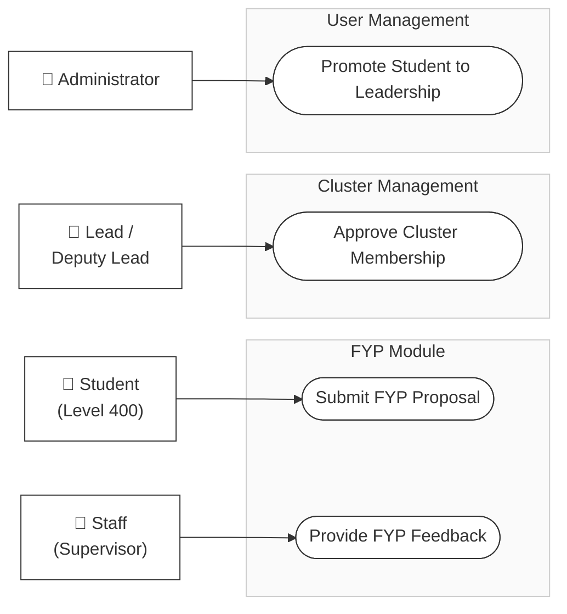
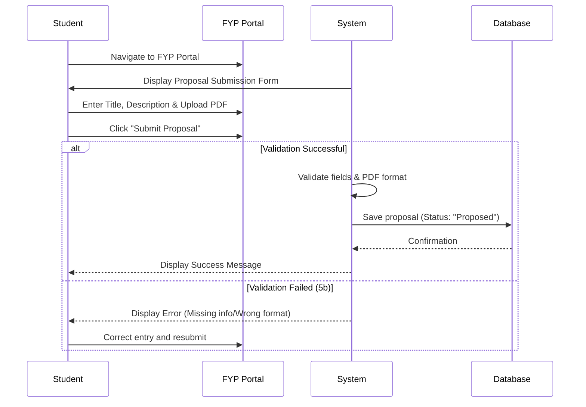
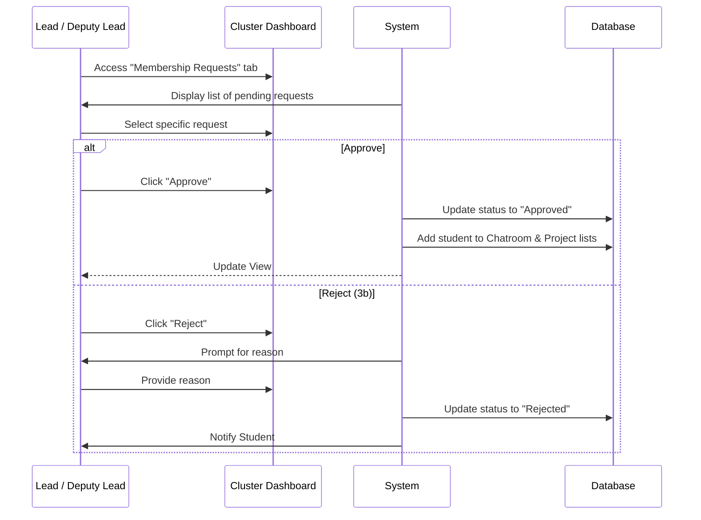
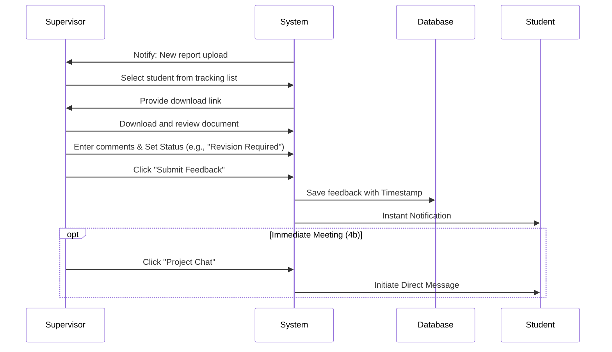
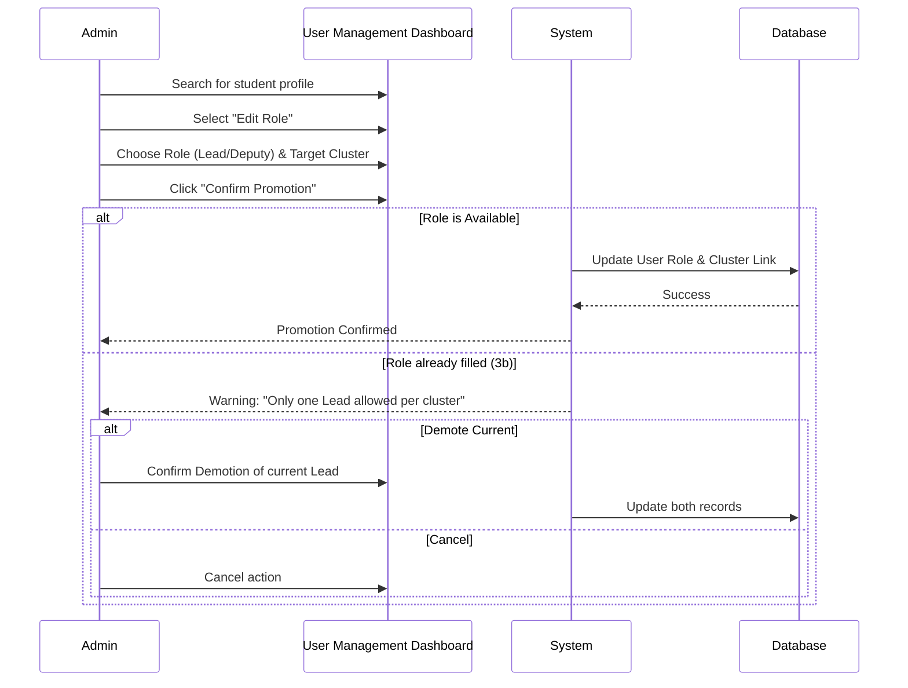

# Swebuk Use Case Interactions

This document visualizes the interactions and system flows for key operations within the Swebuk platform using Mermaid.js.

## 1. Overall Use Case Diagram

---

## 2. Interaction Flows (Sequence Diagrams)

### 2.1. Submit FYP Proposal (Table 3.1)
**Actor:** Student (Level 400)

### 2.2. Approve Cluster Membership (Table 3.2)
**Actor:** Lead Student / Deputy Lead

### 2.3. Provide FYP Feedback (Table 3.3)
**Actor:** Staff (Supervisor)

### 2.4. Promote Student to Leadership (Table 3.4)
**Actor:** Administrator

