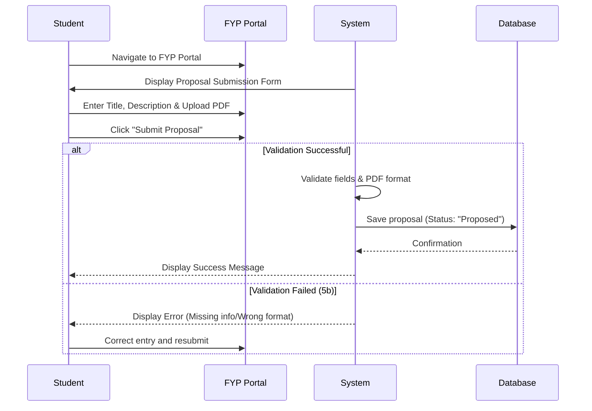
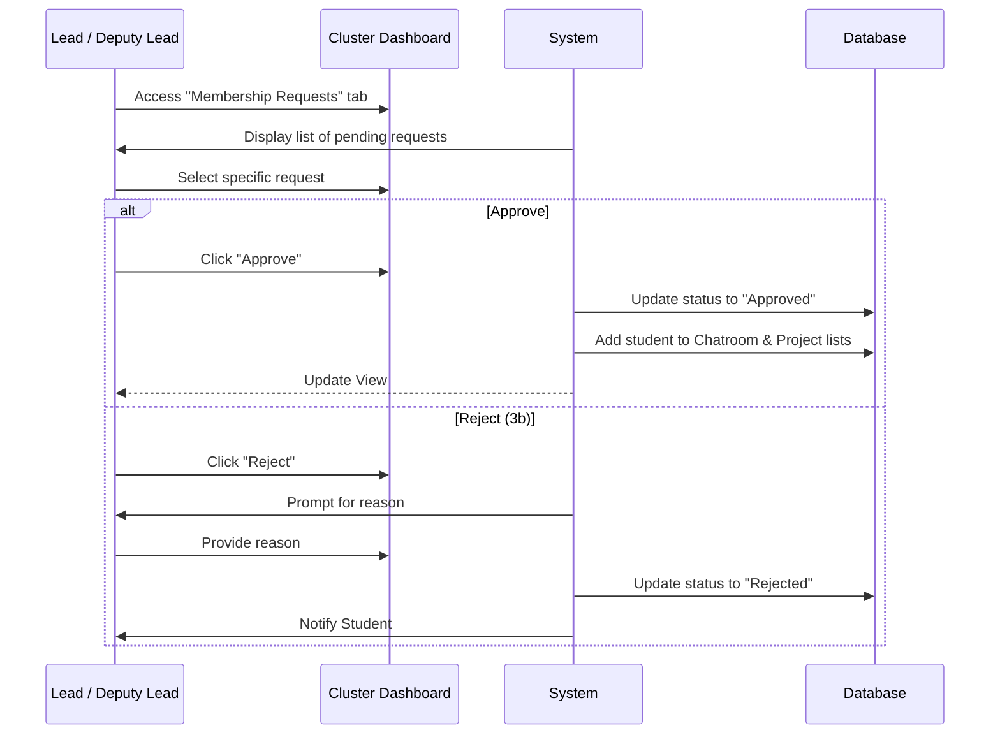
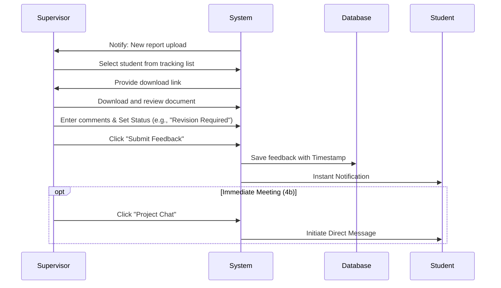
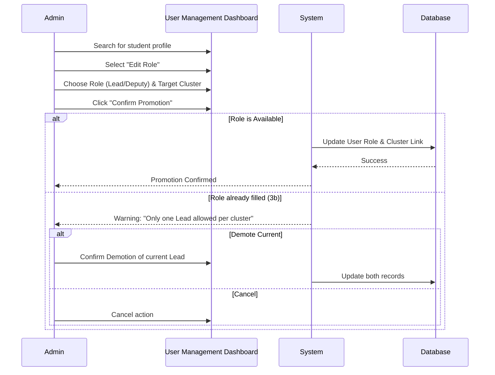

# Swebuk Use Case Interactions

This document visualizes the interactions and system flows for key operations within the Swebuk platform using Mermaid.js.

## 1. Overall Use Case Diagram

```mermaid
useCaseDiagram
    actor "Student (Level 400)" as Student
    actor "Lead / Deputy Lead" as Lead
    actor "Staff (Supervisor)" as Supervisor
    actor "Administrator" as Admin

    package "FYP Module" {
        usecase "Submit FYP Proposal" as UC_SubmitFYP
        usecase "Provide FYP Feedback" as UC_Feedback
    }

    package "Cluster Management" {
        usecase "Approve Cluster Membership" as UC_ApproveMember
    }

    package "User Management" {
        usecase "Promote Student to Leadership" as UC_Promote
    }

    Student --> UC_SubmitFYP
    Lead --> UC_ApproveMember
    Supervisor --> UC_Feedback
    Admin --> UC_Promote
```

---

## 2. Interaction Flows (Sequence Diagrams)

### 2.1. Submit FYP Proposal (Table 3.1)
**Actor:** Student (Level 400)



### 2.2. Approve Cluster Membership (Table 3.2)
**Actor:** Lead Student / Deputy Lead



### 2.3. Provide FYP Feedback (Table 3.3)
**Actor:** Staff (Supervisor)



### 2.4. Promote Student to Leadership (Table 3.4)
**Actor:** Administrator


